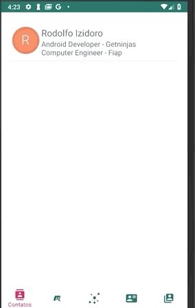

# MovileNext3_Android_RodolfoIzidoro
Projeto de TCC do 3 Movile Next Android MovileNext3_Android_RodolfoIzidoro

### O que fazer?
Desenvolver um aplicativo.
O app precisa ter algum tipo de ligação com os negócios que a Movile desenvolve
atualmente, como: Food, Tickets, Education & Care, Marketplace e Payments.

### Proposta
Pensando nos produtos da Movile e empresas como a Sympla e no mercado de Networking resolvi fazer um aplicatvivo
de compartilhamento de contatos. Pensando nas pessoas que vão em eventos, meetups, workshops muito delas não tem
cartões de visita.
No meu TCC da faculdade em 2017 eu fiz a primeira versão do Meu Contato, e como o tema era parecido resolvi
fazer uma versão 2.0 com todas as tecnologias atuais.
Caso queira saber mais da proposta de valor escrevi um artigo a um tempo atrás: 
https://www.linkedin.com/pulse/melhor-forma-compartilhar-o-seu-contato-rodolfo-izidoro-de-morais/

#### Observações
Essa foi a minha primeira experiencia utilizando databinding, livedata, viewmodel, coroutines, firestore, koin.
Antes do projeto tinha experiencia apenas com MVP, Rx, Dagger1.
Foi bem interessante ver as diferencas de cada estrutura e comparar os pontos positivos e negativos.

# Screenshots and GIFS

# Lista de Tarefas
 - [ ] Criação de Testes.
 - [ ] Habilitar multiplos perfis.
 - [ ] Habilitar multiplos contatos.
 - [ ] Habilitar mais tipos de contatos.
 - [ ] Habilitar exclusão.
 - [ ] Habilitar Logout
 - [ ] Criar filtro de contatos
 - [ ] Melhorar tela de compartilhar
 - [ ] Melhorar tratamento de erros.
 - [ ] Remover boilerplates
 - [ ] Estruturar melhor o Firestore.
 - [ ] Adicionar validação de formulário
 - [ ] Adicionar mascaras nos campos.

# Bibliotecas e Frameworks
#### Injeção de Dependencia
- Koin
#### Android 
- AndroidX
- Databinding
- Coroutines
- RxJava
- Retrofit
- Picasso
- Anko
- TextDrawable
- Zxing
- Youse Forms
#### Banco de Dados
- Firestore
- Firebase Authentication

#### Arquitetura
Arquitetura MVVM com livedata , databinding e coroutines para a camada de rede.

